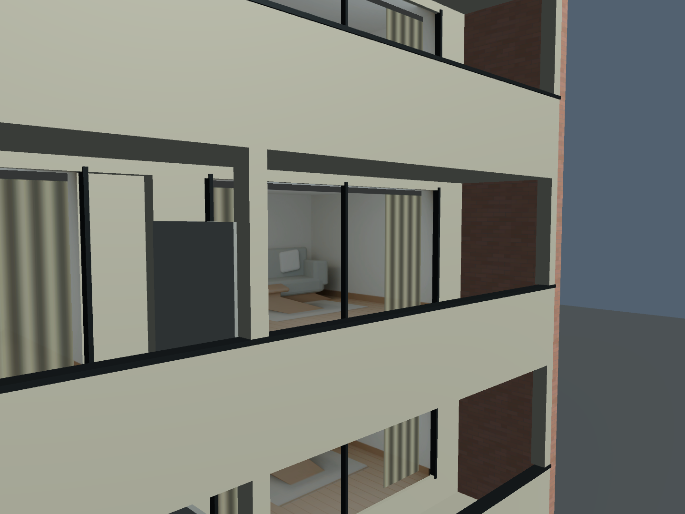
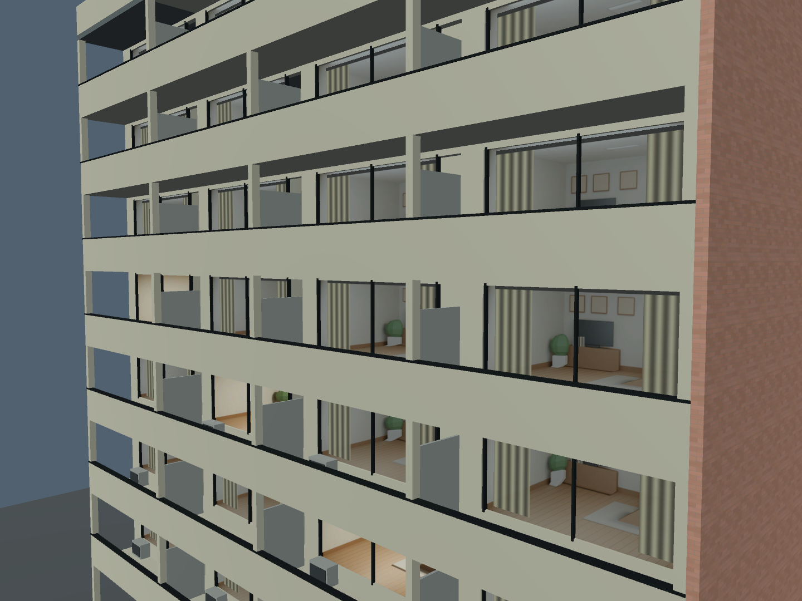

# 住宅内装サンプルとUnity検証

`Samples/Residential/ApartmentDay.mat` と `ApartmentLit.mat` は、家具のある横長リビングを表示します。部屋画像は1536×722pxです。画像・シェーダー・元の簡略部屋サンプルはそれぞれ独立しています。

## 窓の寸法とUV

サンプルの仮想窓全体は幅4.47m、高さ2.10m、部屋奥行き3.2mです。モデル側のオブジェクト空間の寸法に合わせて `_WindowSize` と `_RoomDepth` を変更してください。今回の建物に合わせた値であり、一般的な住宅寸法の規格ではありません。

同じ部屋を左右の窓で表す場合、部屋全体に対してUV0を0～1で割り当てます。例として、左窓の横範囲が0～2.22m、右窓が2.25～4.47mなら、それぞれU=0～0.496644、0.503356～1です。方立に相当する間隔も保持します。各窓のUVを0～1に戻すと、同じ部屋が2つ複製されます。

## 編集・再生成

`Sources~/ApartmentRoomSource_v001.blend` に壁、床、家具、カメラ、ライトの編集可能なモデルがあります。室内はシェーダーのための画像制作ソースであり、Unityへ家具の実メッシュを追加するものではありません。

Blenderから `Tools~/render_apartment_room.py` を実行すると、住宅サンプルの昼間・点灯画像、内装ソース、`Sources~/room_spec.json` を再生成します。意図的にその生成ファイルを更新するスクリプトなので、手編集した版は別名で保持してください。

カメラ距離Cと室内奥行きDを3.2mずつにして、窓全体が画面に収まる焦点距離で一点透視レンダーを作っています。`_BackWallScale = C / (C + D) = 0.5` です。画像の中にあるテーブルやソファには独立した立体の視差はなく、壁・床に投影された描き込みとして変形します。手前に置く要素は、既存の中間レイヤーを使えます。

## 確認結果

Unity 2022.3.22f1 / Windows D3D11の隔離プロジェクトで、建物49室・98枚の窓を検証しました。UV0、UV2、接線を実インポートで確認し、室内面196三角形とシェーダーエラー0を確認しました。

負のXスケール配置を描画し、画像を左右反転して通常配置と比較しました。平均絶対RGB誤差は元シェーダー0.03402237、修正版0.000002964543（0～1の色値）でした。オブジェクト空間の接線基底へワールド変換の反転符号を二重適用していた点を修正しています。カーテンのミップには投影後UVの微分を使い、オブジェクト空間の寸法を変える動的バッチを禁止しています。

VRの左右眼、VRChatのミラー、Android実機、ライトベイク、VRChat歩行は未検証です。今回の確認シーンは表示用で、ワールドとしてのアップロード設定やコライダーは含みません。
