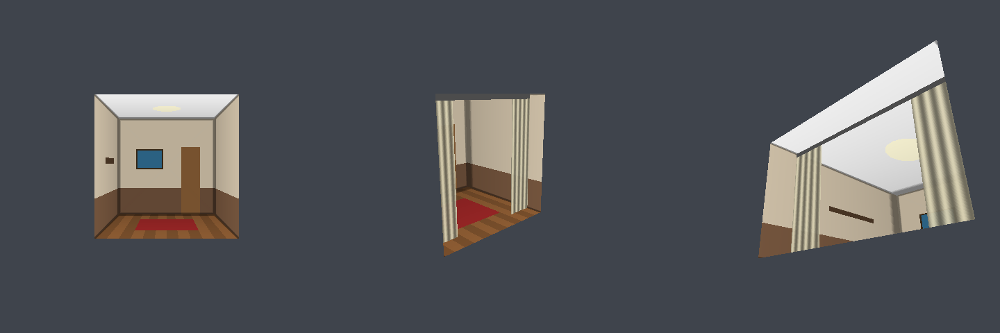

# fake-interior-shader
sizimityper's fake interior shader - Unity shader (VRChat / Built-in RP)

Claudeくんと一緒に作っている、窓の板ポリ1枚の奥に部屋があるように見せるフェイクインテリア（インテリアマッピング）シェーダーです〜



## 特徴
- 一点透視で描いた部屋の画像 **1枚** だけで、立体的な部屋を描画（1マテリアル = 1部屋）
- 部屋の奥行き・窓サイズをメートル単位で指定
- 中間レイヤー（カーテン・ブラインド・手前の家具など）を1枚、視差つきで重ねられる
- ガラスの色味・汚れのオーバーレイ
- Unlit（ライティング計算なし）・軽量。Single Pass Instanced / GPU Instancing 対応

## 使い方
1. 窓ガラス面の板ポリ（UV 0〜1 が窓全体）に `sizimityper/FakeInterior` のマテリアルを割り当てる
2. `部屋テクスチャ` に部屋画像を設定
3. `窓のサイズ XY` に板ポリの実寸（オブジェクト空間）を、`部屋の奥行き` に部屋の奥行きを入力
4. `奥壁の大きさ` を画像の奥壁の幅（画像幅に対する比率）に合わせる

※ メッシュの法線・接線が必要です（Unity のインポート設定で Tangents を Import / Calculate にしてください）。
※ 非一様スケールのオブジェクトでは、窓サイズをスケール前の値で入れてください。

## 部屋テクスチャの作り方
窓の **正面・中央** から部屋を見た一点透視の画像です。

```
┌──────────────┐
│＼   天井   ／│
│  ┌──────┐  │
│左│ 奥壁 │右│   ← 奥壁は画像の中央。幅 = 画像幅 × 奥壁の大きさ
│  └──────┘  │
│／   床     ＼│
└──────────────┘
```
- 画像の外枠 = 窓の枠、四隅の対角線 = 部屋の角
- テクスチャの Wrap Mode は **Clamp** 推奨

### Blender でレンダリングする場合
- 窓と同じ大きさ（幅 W × 高さ H）、奥行き D の部屋を作る
- カメラを窓の中心の正面、窓から距離 C の位置に置き、窓に向ける
- 解像度の縦横比を W:H、センサーフィットを Horizontal、焦点距離を「窓の幅 W がちょうど画面に収まる」値にする
  （FOV の半角 θ が tan θ = (W/2) / C）
- このとき `奥壁の大きさ` = C / (C + D)
  - 例: C = D なら 0.5

## ライセンス
MIT License
